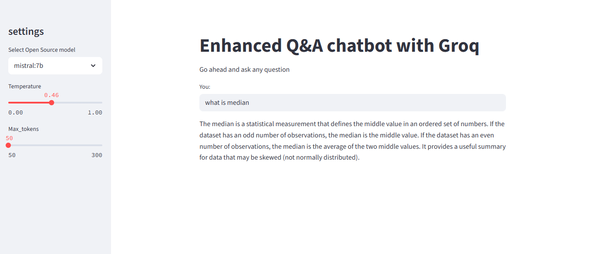

# Enhanced Q&A Chatbot with Ollama

A Streamlit-based chatbot powered by LangChain and Ollama for answering user questions using open-source LLMs.


## Features

-Interactive Streamlit UI for chatting with AI

✅ Choose from multiple Ollama models (mistral:7b, phi3)

✅ Adjustable temperature and max tokens for responses

✅ LangSmith integration for tracing and analytics

✅ Lightweight and easy to deploy locally


## Installation

1. Clone the repository

```bash
 git clone https://github.com/your-username/ollama-chatbot.git
cd ollama-chatbot
```

2. Create and activate a virtual environment

```bash
python -m venv venv
venv\Scripts\activate
```

3. Install dependencies

```bash
pip install -r requirements.txt
```

4. Set up environment variables


## Configuration
Create a .env file in the project root:
```bash
LANGCHAIN_API_KEY=your_langchain_api_key

```
## Deployment

To deploy this project in streamlit

```bash
pip install -r requirements.txt
  streamlit run app.py
```


## Settings In The Sidebar

Model Selection: Choose between mistral:7b and phi3

Temperature: Adjust creativity of responses (0.0–1.0)

Max Tokens: Set response length (50–300)
## Demo

Insert gif or link to demo


## Dependencies

Streamlit

LangChain

Ollama

python-dotenv
## Contributing

Contributions are welcome! Please open an issue or submit a pull request.


## License

[MIT](https://choosealicense.com/licenses/mit/)


## 🚀 About Me
I'm An LLM developer With Generative AI And Agentic AI Skills...


## 🔗 Links

[](https://www.linkedin.com/in/reeshma-ram-prasad-96997a20a/)


## Screenshots



